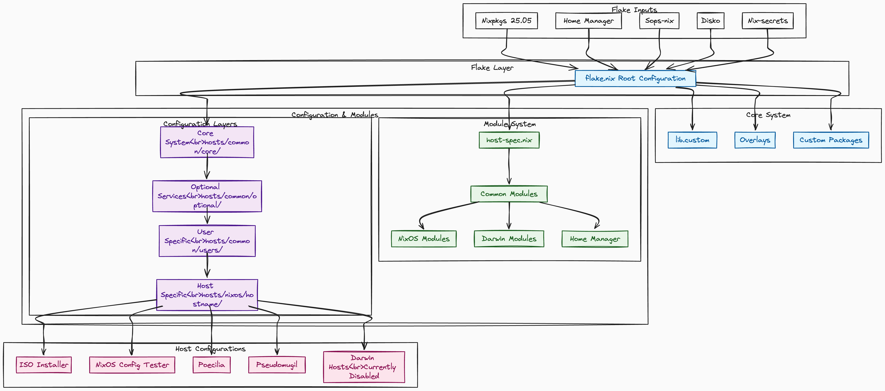
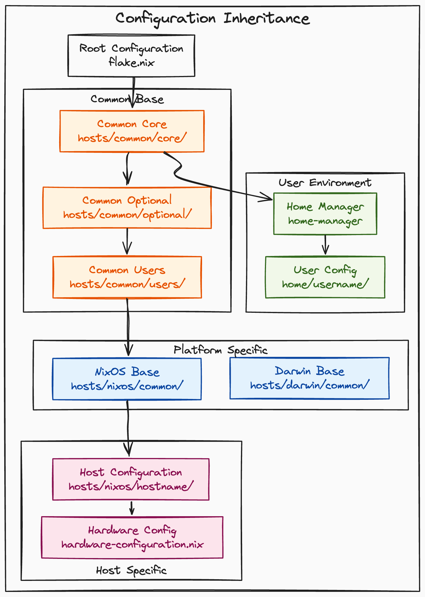

# ChanningHe's Nix-Config
Fork from [EmergentMind/nix-config-starter](https://github.com/EmergentMind/nix-config-starter)

## WIP!

## System Architecture Overview

*Generated with [mermaid-to-excalidraw](https://github.com/excalidraw/mermaid-to-excalidraw)*

## Configuration Inheritance Hierarchy

*Generated with [mermaid-to-excalidraw](https://github.com/excalidraw/mermaid-to-excalidraw)*

## Installation on Remote Targets

For details on how to use the nixos-installer directory and `scripts/bootstrap-nixos.sh` script, please see my article and accompanying YouTube video [Remotely Installing NixOS and nix-config with Secrets](https://unmovedcentre.com/posts/remote-install-nixos-config/).

## Guidance and Resources

- Watch NixOS related videos on my [YouTube channel](https://www.youtube.com/@Emergent_Mind).
- Chat with me directly on our [Discord server](https://discord.gg/XTFg57xGxC).

- [NixOS.org Manuals](https://nixos.org/learn/)
- [Official Nix Documentation](https://nix.dev)
  - [Best practices](https://nix.dev/guides/best-practices)
- [Noogle](https://noogle.dev/) - Nix API reference documentation.
- [Official NixOS Wiki](https://wiki.nixos.org/)
- [NixOS Package Search](https://search.nixos.org/packages)
- [NixOS Options Search](https://search.nixos.org/options?)
- [Home Manager Option Search](https://home-manager-options.extranix.com/)
- [NixOS & Flakes Book](https://nixos-and-flakes.thiscute.world/) - an excellent introductory book by Ryan Yin

## Acknowledgements

Those who have heavily influenced this strange journey into the unknown.
- [NixOS Secrets Management](https://unmovedcentre.com/posts/secrets-management/)
- [nix-secrets-reference](https://github.com/EmergentMind/nix-secrets-reference)
- [FidgetingBits](https://github.com/fidgetingbits) - You told me there was a strange door that could be opened. I'm truly grateful.
- [Mic92](https://github.com/Mic92) and [Lassulus](https://github.com/Lassulus) - My nix-config leverages many of the fantastic tools that these two people maintain, such as sops-nix, disko, and nixos-anywhere.
- [Misterio77](https://github.com/Misterio77) - Structure and reference.
- [Ryan Yin](https://github.com/ryan4yin/nix-config) - A treasure trove of useful documentation and ideas.
- [VimJoyer](https://github.com/vimjoyer) - Excellent videos on the high-level concepts required to navigate NixOS.
