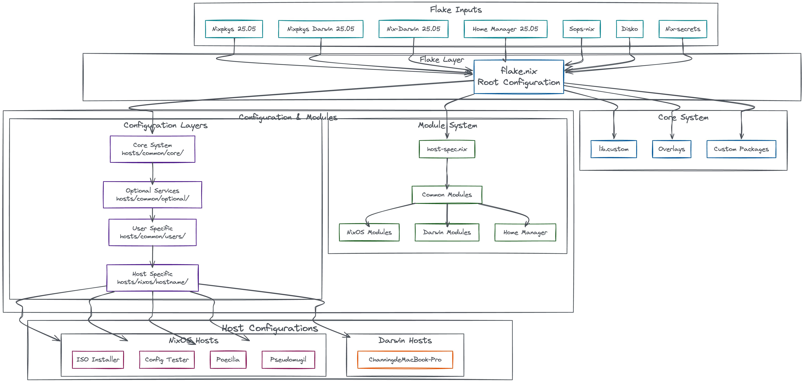
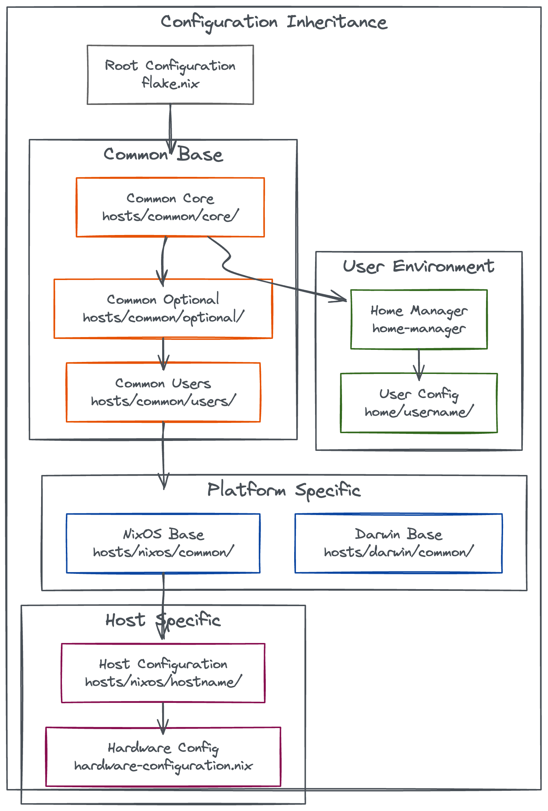

# ChanningHe's Nix-Config

Personal NixOS + Darwin configuration managing a mix of home servers, VMs, and a MacBook. Built on top of [EmergentMind/nix-config-starter](https://github.com/EmergentMind/nix-config-starter), adapted for my own setup over time.

Secrets are managed with sops-nix and kept in a separate private repo. Most machines run NixOS; the MacBook uses nix-darwin.

## Hosts

| Host | Form Factor | CPU | Memory | Other | Role |
|------|-------------|-----|--------|-------|------|
| `Annulatus` | KVM VM | AMD EPYC 7C13 | 64 GB | — | Primary services |
| `Platypus` | Desktop | Intel Core i9-12700K | 32 GB | RTX 3070 | Gaming / Workstation |
| `Poecilia` | Mini PC | AMD Ryzen 9 8745HS | 32 GB | — | HA services |
| `Pseudomugil` | Server | AMD EPYC 7D12 | 64 GB | — | Remote testing |
| `Toxotidae` | KVM VM | AMD EPYC 7C13 | 128 GB | — | Build / CI testing |
| `Macrouridae` | NAS | Intel Atom C3558 | 4 GB | — | Cold backup |
| `ChanningdeMacBook-Pro` | Laptop | Apple M4 Pro | 48 GB | — | Primary workstation |
| `nixos-rl` | LXC Container | AMD EPYC 7C13 | 128 GB | — | Primary services (To be deprecated) |

## System Architecture Overview

*Generated with [mermaid-to-excalidraw](https://github.com/excalidraw/mermaid-to-excalidraw)*

## Configuration Inheritance Hierarchy

*Generated with [mermaid-to-excalidraw](https://github.com/excalidraw/mermaid-to-excalidraw)*

## References
Fork from [EmergentMind/nix-config-starter](https://github.com/EmergentMind/nix-config-starter)

## Guidance and Resources

- [NixOS.org Manuals](https://nixos.org/learn/)
- [Official Nix Documentation](https://nix.dev)
  - [Best practices](https://nix.dev/guides/best-practices)
- [Noogle](https://noogle.dev/) - Nix API reference documentation.
- [Official NixOS Wiki](https://wiki.nixos.org/)
- [NixOS Package Search](https://search.nixos.org/packages)
- [NixOS Options Search](https://search.nixos.org/options?)
- [Home Manager Option Search](https://home-manager-options.extranix.com/)
- [NixOS & Flakes Book](https://nixos-and-flakes.thiscute.world/) - an excellent introductory book by Ryan Yin
- [nix-darwin](https://github.com/nix-darwin/nix-darwin) - Nix-Darwin is a NixOS module for Darwin systems, like macOS.
- [nix-darwin Documentation](https://nix-darwin.github.io/nix-darwin/manual/index.html)

## Acknowledgements

Those who have heavily influenced this strange journey into the unknown.
- [NixOS Secrets Management](https://unmovedcentre.com/posts/secrets-management/)
- [nix-secrets-reference](https://github.com/EmergentMind/nix-secrets-reference)
- [FidgetingBits](https://github.com/fidgetingbits) - You told me there was a strange door that could be opened. I'm truly grateful.
- [Mic92](https://github.com/Mic92) and [Lassulus](https://github.com/Lassulus) - My nix-config leverages many of the fantastic tools that these two people maintain, such as sops-nix, disko, and nixos-anywhere.
- [Misterio77](https://github.com/Misterio77) - Structure and reference.
- [Ryan Yin](https://github.com/ryan4yin/nix-config) - A treasure trove of useful documentation and ideas.
- [VimJoyer](https://github.com/vimjoyer) - Excellent videos on the high-level concepts required to navigate NixOS.
