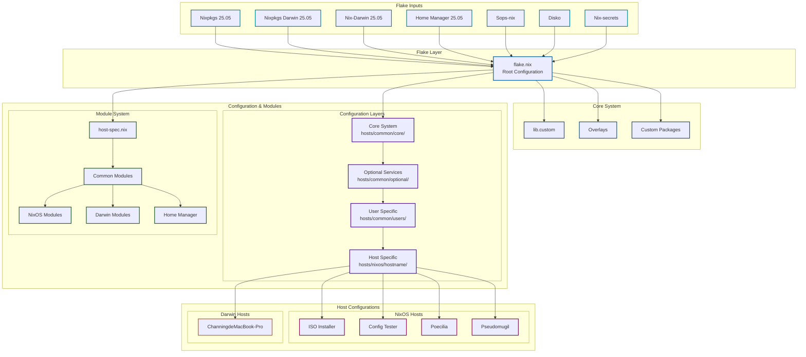
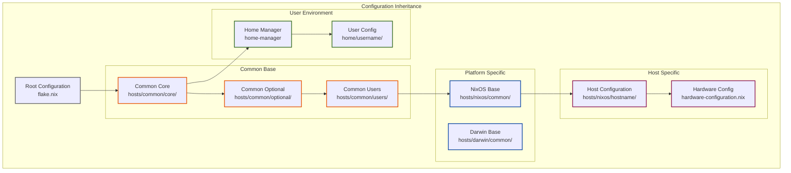
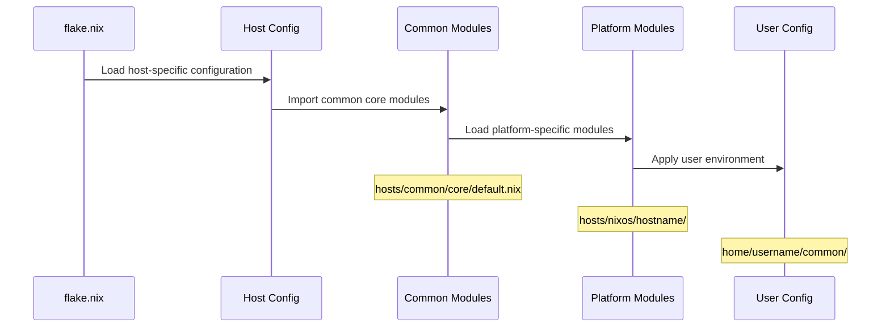
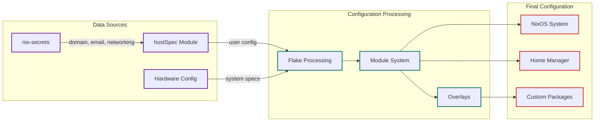
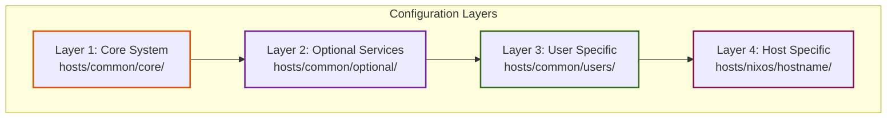
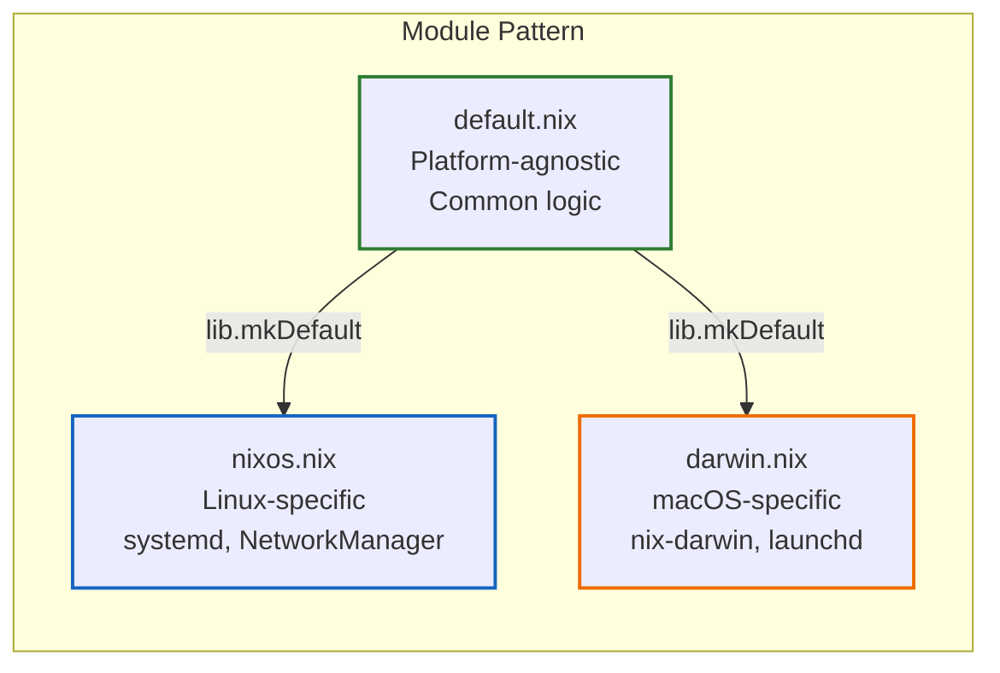

# Nix-Config Modular Framework Architecture
> Supports both NixOS and Darwin (macOS) with platform-agnostic design

## System Architecture Overview



## Configuration Inheritance Hierarchy



## Module Loading Flow



## Data Flow Diagram



## Key Directory Structure

```
nix-config/
├── hosts/                        # Host configurations
│   ├── common/                   # Common configurations
│   │   ├── core/                 # Core system configuration
│   │   │   ├── default.nix      # Platform-agnostic core
│   │   │   ├── nixos.nix        # NixOS-specific core
│   │   │   ├── darwin.nix       # Darwin-specific core
│   │   │   └── sops.nix         # Secrets management
│   │   ├── optional/             # Optional services
│   │   └── users/                # User configurations
│   │       └── channinghe/       
│   │           ├── default.nix   # Platform-agnostic user config
│   │           ├── nixos.nix     # NixOS-specific user config
│   │           └── darwin.nix    # Darwin-specific user config
│   ├── nixos/                    # NixOS specific hosts
│   │   ├── poecilia/
│   │   ├── pseudomugil/
│   │   ├── iso/                  # ISO installer
│   │   └── tester/               # Config tester
│   └── darwin/                   # Darwin specific hosts
│       └── ChanningdeMacBook-Pro/
├── home/                         # Home Manager configurations
│   └── channinghe/               # User-specific configurations
│       ├── common/
│       │   ├── core/             # Core user modules
│       │   │   ├── default.nix   # Platform-agnostic
│       │   │   ├── nixos.nix     # NixOS-specific
│       │   │   ├── darwin.nix    # Darwin-specific
│       │   │   └── zsh.nix       # Zsh configuration
│       │   ├── dotfiles/         # Configuration files
│       │   │   └── p10k.zsh      # Powerlevel10k config
│       │   └── optional/         # Optional user modules
│       │       └── ssh-agent.nix # SSH agent management
│       ├── poecilia.nix          # Host-specific HM config
│       └── ChanningdeMacBook-Pro.nix
├── modules/                      # Reusable modules
│   ├── common/                   # Common modules
│   │   └── host-spec.nix         # Host specification module
│   ├── hosts/                    # Host modules
│   └── home/                     # Home Manager modules
├── overlays/                     # Package overlays
├── pkgs/                         # Custom packages
├── lib/                          # Custom library functions
└── scripts/                      # Helper scripts
    ├── rebuild.sh                # Platform-aware rebuild
    └── check-sops.sh             # SOPS verification
```

## Quick Reference

| Layer | Path | Purpose | Platform |
|-------|------|---------|----------|
| Core | `hosts/common/core/default.nix` | System-wide settings | Both |
| Core | `hosts/common/core/nixos.nix` | NixOS-specific settings | NixOS |
| Core | `hosts/common/core/darwin.nix` | Darwin-specific settings | Darwin |
| Optional | `hosts/common/optional/` | Optional services | Both |
| Users | `hosts/common/users/*/default.nix` | User configurations | Both |
| Users | `hosts/common/users/*/nixos.nix` | User NixOS config | NixOS |
| Users | `hosts/common/users/*/darwin.nix` | User Darwin config | Darwin |
| Host | `hosts/nixos/*/default.nix` | NixOS host setup | NixOS |
| Host | `hosts/darwin/*/default.nix` | Darwin host setup | Darwin |
| Home | `home/*/common/core/` | User environment modules | Both |
| Home | `home/*/common/dotfiles/` | Configuration files | Both |

## Layered Architecture



## Platform-Specific Modular Design Pattern

### Design Philosophy

The configuration uses a **three-file pattern** for platform-agnostic design:



### Key Principles

1. **Platform-Agnostic Base (`default.nix`)**
   - Use `lib.mkDefault` for values that can be overridden
   - Only include truly cross-platform logic
   - Example: User name, shell (with mkDefault), SSH keys

2. **Platform-Specific Extensions**
   - `nixos.nix` - Linux-only packages (ethtool, systemd)
   - `darwin.nix` - macOS-only settings (TouchID, Homebrew paths)

3. **Priority System**
   ```nix
   # default.nix - low priority
   shell = lib.mkDefault pkgs.bash;
   
   # darwin.nix - normal priority (overrides default)
   shell = pkgs.zsh;
   
   # If conflicts - use lib.mkForce (high priority)
   nix.registry = lib.mkForce { ... };
   ```

### Examples

#### Host-Level Configuration

```
hosts/common/core/
├── default.nix    # Nix settings, common packages
├── nixos.nix      # Linux packages, systemd
├── darwin.nix     # macOS settings, Touch ID
└── sops.nix       # Secrets (platform-aware)
```

#### User-Level Configuration

```
hosts/common/users/channinghe/
├── default.nix    # Name, SSH keys (mkDefault shell)
├── nixos.nix      # Groups, systemd tmpfiles
└── darwin.nix     # Home path, zsh shell override
```

#### Home-Manager Configuration

```
home/channinghe/common/core/
├── default.nix    # Import all modules
├── nixos.nix      # Linux-specific packages
├── darwin.nix     # macOS-specific packages
├── zsh.nix        # Shell config (platform-agnostic)
└── ../dotfiles/   # Config files (p10k.zsh)
```

### Platform Detection

The framework uses `hostSpec.isDarwin` and `pkgs.stdenv` for platform detection:

```nix
# Method 1: Using hostSpec
lib.mkIf (!config.hostSpec.isDarwin) {
  # NixOS-only config
}

# Method 2: Using pkgs.stdenv
lib.optionalAttrs pkgs.stdenv.isLinux {
  # Linux-only config
}

# Method 3: File-level separation
# hosts/common/core/default.nix imports:
../users/${username}/default.nix  # Always
../users/${username}/nixos.nix    # Only on NixOS
../users/${username}/darwin.nix   # Only on Darwin
```

### Common Pitfalls and Solutions

| Issue | Problem | Solution |
|-------|---------|----------|
| Option conflicts | Same option defined twice | Use `lib.mkDefault` in base |
| Missing group | Darwin users don't have `group` | Use `lib.optionalAttrs` |
| Wrong stateVersion | String vs Int | NixOS=string, Darwin=int |
| Auto-optimise-store | Corrupts on Darwin | Use `nix.optimise.automatic` |
| SOPS paths | Different SSH key paths | Conditional `sshKeyPaths` |
