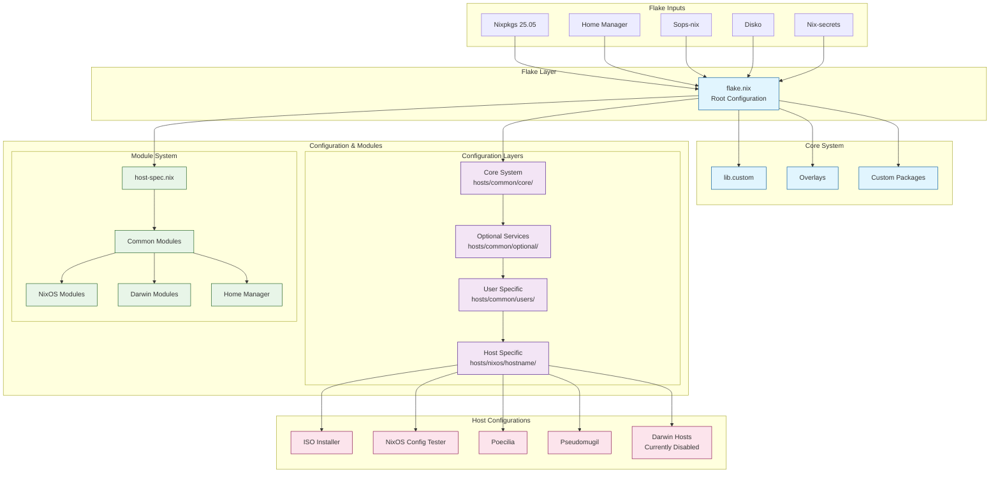
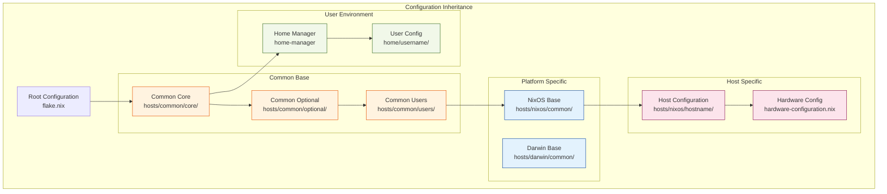
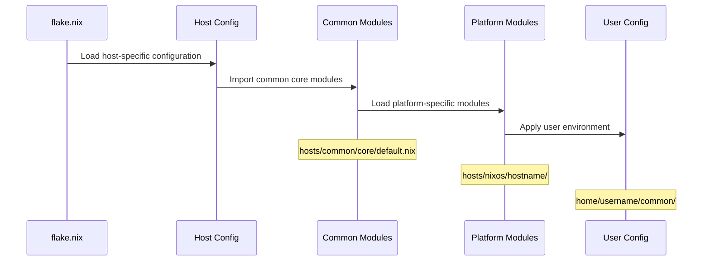
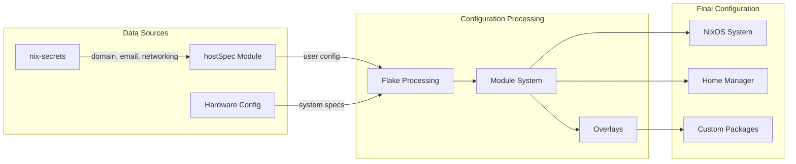
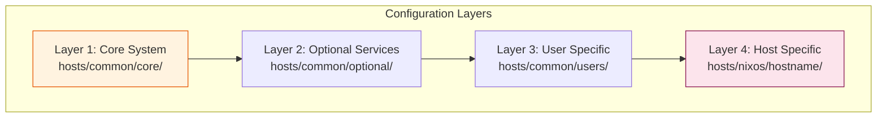

# NixOS Modular Framework Architecture

## System Architecture Overview



## Configuration Inheritance Hierarchy



## Module Loading Flow



## Data Flow Diagram



## Key Directory Structure

```
nix-config/
├── hosts/                    # Host configurations
│   ├── common/              # Common configurations
│   │   ├── core/            # Core system configuration
│   │   ├── optional/        # Optional services
│   │   └── users/           # User configurations
│   ├── nixos/               # NixOS specific hosts
│   └── darwin/              # Darwin specific hosts
├── home/                    # Home Manager configurations
│   └── username/            # User-specific configurations
├── modules/                 # Reusable modules
│   ├── common/              # Common modules
│   ├── hosts/               # Host modules
│   └── home/                # Home Manager modules
├── overlays/                # Package overlays
├── pkgs/                    # Custom packages
└── lib/                     # Custom library functions
```

## Quick Reference

| Layer | Path | Purpose |
|-------|------|---------|
| Core | `hosts/common/core/` | System-wide settings |
| Optional | `hosts/common/optional/` | Optional services |
| Users | `hosts/common/users/` | User configurations |
| Host | `hosts/nixos/*/default.nix` | Host-specific setup |
| Home | `home/*/common/` | User environment |

## Layered Architecture


